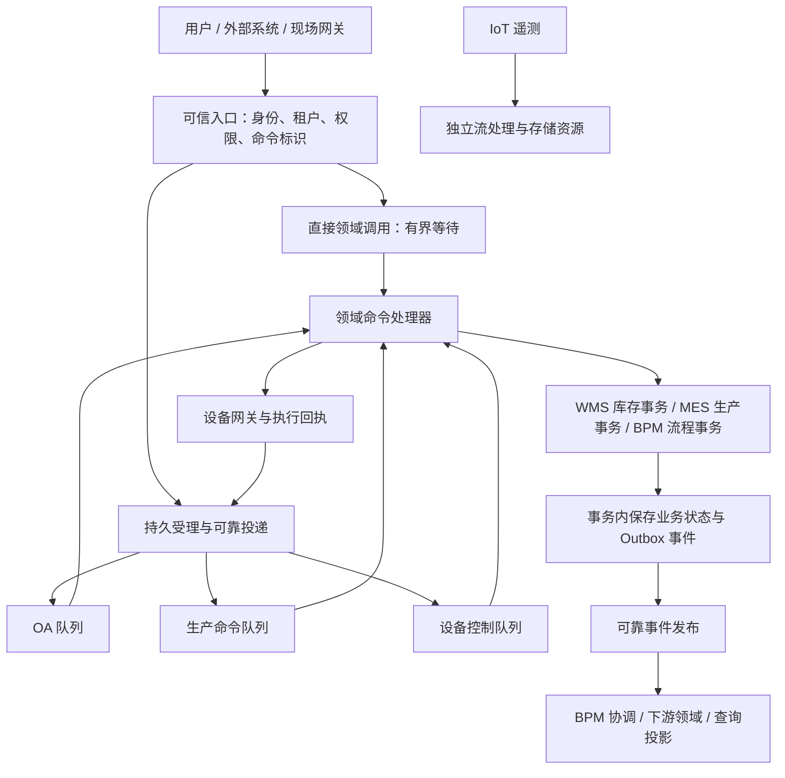

# OA、MES、WMS、IoT 统一业务架构评审方案

- 日期：2026-09-30
- 角色：Planner
- 状态：架构讨论稿，待评审；不构成实施授权或已批准架构决策
- 目标：普通 OA 可靠异步，MES 生产动作及时送达，WMS 核心数据一致，IoT 接入与控制可扩展、可追踪。
- 依据：本轮架构讨论、现有 P4 流程双通道方向及公开技术文档。未核查当前工程实现、部署容量或性能数据；文中建议与既有实现事实分别表达。

## 1. 提请评审的结论

建议采用“领域内事务保证正确，领域间可靠消息保证协同，关键生产链路保证时效”的混合架构。

1. 保留可靠 MQ 能力，按 OA、生产命令、IoT 控制、遥测等负载特征分通道；不要求所有业务操作都先经过统一 MQ。
2. 对库存预占、过站校验等需要立即决策的操作，允许直接调用权威领域服务，等待本次事务结果。
3. 直接调用与队列消费进入同一套领域规则，使用统一命令身份、幂等与结果语义。
4. WMS 在合理的本地事务边界内保护库存余额、预占和流水等业务约束；跨领域事件通过 Outbox 等可靠机制传播。
5. MES 以目标受理、状态提交、设备结果等端到端指标衡量时效，提供预留容量、业务截止时间和明确的超时反馈。
6. 暂不引入独立的内存加急执行通道。若后续证据表明调度开销不可接受，可增加对已持久化命令的快速唤醒；持久恢复与快速路径共享领取和幂等机制。
7. Reactor / WebFlux 按高并发等待、连接和流式处理需求引入，不以全面响应式改造作为业务正确性或低延迟的前提。

该建议统一业务契约，允许执行与通信方式按场景选择。部署可从模块化单体或少量服务开始；引入消息机制不要求立即拆成微服务。

## 2. 目标与架构边界

### 2.1 目标

- OA：受理后可恢复，不因重启或短暂中断丢失业务意图，结果可查询。
- MES：约定负载下满足时效目标；不能按时完成时及时暴露真实状态，避免过期生产动作。
- WMS：竞争、重复请求、消息重投和故障恢复下，仍满足库存业务约束。
- IoT：遥测流量不挤占关键控制链路；设备动作与回执可关联、可对账。
- BPM：提供统一过程协调和异常处理，保持流程规则、权限与审计一致。

### 2.2 边界

本稿不指定 MQ 厂商、集群规模、固定 SLA 数值、最终数据库隔离级别或具体类与表结构；这些需要结合业务预算和工程证据评审。也不承诺广域网故障或设备离线时仍能按时送达，不宣称网络层 exactly-once。

对于要求确定时限的设备联锁和控制闭环，应由适合的 PLC、边缘或现场控制系统承担；平台负责业务协调和结果追踪。具体边界由现场控制要求确定。

## 3. 场景判断矩阵

| 场景 / 操作 | 核心约束 | 推荐入口与处理 | 结果含义 | 主要风险 |
|---|---|---|---|---|
| OA 审批发起、普通流转 | 可靠、权限正确、可恢复 | 持久受理，普通队列异步推进 | 受理与办理成功明确区分 | 消息丢失、重复办理、无限重试 |
| MES 过站校验、工序放行 | 正确、低尾延迟、状态有效 | 直接领域调用或独立生产通道，有界等待 | 校验 / 本次状态迁移已提交 | 队列积压、热点锁、超时后重复执行 |
| MES 派工、异常处置 | 及时受理、顺序、可追踪 | 生产命令通道，业务回执 | 目标已受理或已完成指定动作 | Broker 确认冒充业务送达 |
| WMS 库存预占、扣减 | 不超卖、不重复扣减、账目一致 | 权威库存事务；按调用场景直接执行或可靠排队 | 事务提交后才算成功 | 并发竞争、双写间隙、陈旧读 |
| WMS 调拨、盘点调整 | 守恒、可审计、状态演进正确 | 领域事务与业务状态机 | 区分在途、已收货、已调整 | 用单次状态覆盖真实物流过程 |
| IoT 遥测、状态采样 | 吞吐、资源可控 | 流式接入、聚合、背压 | 接收、处理、存储分别定义 | 高频上报挤占生产资源 |
| IoT 设备控制 | 指令有效、顺序、结果可确认 | 持久命令、独立控制通道、设备回执 | 已发送、已受理、执行完成分开 | 重复动作、失联、迟到命令 |
| 跨 OA / WMS / MES / IoT 业务 | 局部正确、整体可恢复 | BPM 协调领域命令与事实事件 | 每阶段有独立完成证据 | 把流程完成误认为物理动作完成 |

系统名称不直接决定一致性强弱或执行方式。OA 状态迁移同样需要事务，MES 同样不能牺牲数据正确性，WMS 报表则可能允许受控的传播延迟。

## 4. 推荐逻辑架构

图中处理器表示统一的业务契约，并非要求所有领域共享一个进程、数据库或线程池。设备命令应先形成持久事实，再调用设备；远程等待不应长期占用库存或流程数据库事务。

### 4.1 领域权威

| 领域 | 权威事实与职责 |
|---|---|
| BPM | 流程实例、任务、协调进度、异常处置；根据领域结果推进流程 |
| WMS | 库存余额、预占、出入库与相关流水；唯一授权的库存写入边界 |
| MES | 工单、工序、过站、生产放行与生产状态 |
| IoT | 设备命令生命周期、网关 / 设备回执、遥测关联 |

BPM 不直接替代 WMS 扣库存或 MES 修改生产事实。跨系统共享界面与流程编排，不意味着共享任意数据写权限。

### 4.2 命令与事件

- 命令表达“请求执行某动作”，必须有明确执行方、权限与结果。
- 事件表达“某事实已经发生”，应在事实提交后发布。
- 请求预占库存不能伪装成库存已预占事件；审批已通过不能推导设备已执行。
- 命令身份、业务关联、事件身份和领域版本各司其职，不能用一个流程实例 ID 代替所有去重与顺序依据。

## 5. 统一命令与状态契约

### 5.1 独立策略维度

| 维度 | 要回答的问题 |
|---|---|
| 业务优先级 | 谁先获得资源，谁拥有保留容量？ |
| 返回策略 | 受理即返回，还是有界等待指定结果？ |
| 事务边界 | 哪些变化必须原子提交？ |
| 顺序范围 | 按流程实例、库存对象、工单还是设备约束？ |
| 截止时间 | 动作最迟何时仍有业务意义？ |
| 恢复方式 | 可重试、待对账、需补偿还是人工介入？ |
| 执行模型 | 阻塞事务、响应式 I/O 或混合执行？ |

高优先级不等于同步调用，异步不等于延迟批处理；调用等待超时不等于业务执行失败。

### 5.2 状态要求

建议至少区分：可靠受理、处理中、成功、明确失败、过期，以及外部结果待核实。具体状态词后续与现有契约对齐，不在本稿新增强制实现枚举。

- 可靠受理：恢复机制能够找回该命令；仅放进内存不算可靠受理。
- 成功：达到本命令约定的完成点，并已保存可追踪结果。
- 超时：首先是观察或等待结果，不能直接覆盖真实业务状态。
- 外部结果待核实：适用于设备可能已动作但回执丢失等情况，不能盲目重发。
- 客户端断开后，已受理命令的生命周期独立于 HTTP 连接或响应式订阅。

### 5.3 幂等、顺序与权限

同一业务意图重试复用命令身份；相同身份携带不同内容应明确冲突。去重标记与业务效果应在适用的事务边界内协调提交，不能先标记已处理再执行导致永久漏办。

同一流程实例、库存竞争对象或设备的必要顺序不能被优先级绕过；不要求全平台全局串行。MQ 分区或顺序消费只能辅助调度，数据库约束与业务版本校验仍需成立。

身份、租户、授权和审计贯穿入口及消费过程。优先级由可信服务端策略确定，不能由普通调用方自报提权。

## 6. WMS 一致性设计原则

### 6.1 领域内强约束

按业务定义确定必须保持的约束，例如可用量不得被重复分配、预占不得重复扣减、库存余额与流水相符。库存维度可能包含货主、仓库、库位、SKU、批次、质量状态和序列号，需由业务确认，不能只按 SKU 粗略锁定。

对必须共同成立的余额、预占和流水变化，优先放在同一个合理的本地事务中。选择原子条件更新、版本校验、行锁或可串行化隔离应依据竞争形态；死锁和序列化冲突需有有界恢复，不能靠无限重试保证成功。

授权库存决策必须访问可支撑该决策的权威状态。允许延迟的报表或查询投影不能作为最终库存放行依据。

### 6.2 跨领域一致性

库存状态与 Outbox 事件同事务保存，投递器随后发布。消费者通过幂等、业务版本和必要的顺序检查应用事件。Outbox 解决数据库变更与发消息之间的双写间隙，不提供跨系统瞬时一致性，也不免除重复投递处理。

若要求 WMS 与 MES 两组数据严格同时提交，应先评估是否应处于同一事务边界。跨服务同步调用并不能自动实现原子提交；独立部署与严格跨域原子性存在需要单独评审的成本。

### 6.3 预占与释放

生产放行依据应是有效预占凭据及当前状态，不能只消费一条可能过期的“预占成功”通知。预占过期释放与生产确认可能竞争，需要在权威状态上原子裁决谁生效。

取消与失败恢复使用明确的释放、冲正或其他业务动作；已经发生的实际出库或设备动作不能仅靠数据库回滚撤销。调拨中间态应反映真实在途事实。

## 7. MES 时效与资源设计原则

### 7.1 衡量终点

分别观察入口到可靠受理、可靠受理到目标业务受理、目标受理到业务提交、命令发送到设备回执的耗时。Broker 发布确认不等于目标服务受理，目标服务受理不等于设备完成。

总耗时至少包含入口校验、持久化、投递、排队、执行资源等待、数据库锁与事务、网络及设备等待。应按分段证据定位瓶颈，不能预设 MQ 是主要延迟来源。

### 7.2 容量与隔离

生产通道应有独立消费者、并发额度和可评估的下游资源预算。队列分开但数据库连接、热点锁或 Broker 磁盘仍共享时，时效仍可能互相影响。是否进一步拆分进程、Broker 或数据库资源由负载和隔离要求决定。

容量不足时采用明确的限流、拒绝或可感知排队策略，不能无限缓冲后仍承诺及时送达。关键生产事件与可抽样遥测采用不同溢出策略。

### 7.3 两种超时

- 接口等待预算：到时结束等待并返回原命令身份及已知状态，不重建任务。
- 业务执行截止时间：超过后动作可能失去意义；执行前及必要的状态转换点检查，并与取消、领取和提交竞争协调。

不能依赖 MQ 消息 TTL 独自阻止迟到动作；已经交付或开始执行的消息仍需业务层判断。已经产生外部副作用时，以对账和业务恢复处理。

### 7.4 待确认的时效口径

| 指标 | 需评审的输入 |
|---|---|
| 目标受理 P99 | 各关键生产操作的目标值及统计窗口 |
| 业务完成预算 | 本次状态提交与设备完成分别定义 |
| 峰值负载 | 稳态吞吐、突发规模、持续时间、热点分布 |
| 过载行为 | 允许排队长度、拒绝策略、生产侧处置 |
| 故障恢复 | 允许中断时间、积压恢复目标、迟到命令处置 |

目前缺少上述业务输入与实测数据，本稿不据此声称已经满足 MES 时效。

## 8. MQ、内存通道与响应式的取舍

| 方案 | 适用价值 | 主要代价 / 局限 | 建议 |
|---|---|---|---|
| 单队列优先级 | 小规模简单分级 | 预取、已执行任务和共享资源限制加急效果 | 不作为关键生产时效的唯一保障 |
| 分通道可靠 MQ | 异步解耦、恢复、分别治理积压 | 仍需管理共享资源与投递耗时 | 默认异步基础设施 |
| 直接领域调用 | 立即业务判断、减少中间调度 | 调用耦合、超时不确定性、目标容量约束 | 适用于库存预占、过站等短操作 |
| 内存独立执行 | 健康状态下路径短 | 进程丢失、双路竞争、顺序与恢复复杂 | 暂不采用 |
| 持久命令 + 快速唤醒 | 减少已落盘命令的调度等待 | 需统一领取、恢复和防重复执行 | 仅在瓶颈证据成立后评审 |
| Reactor / WebFlux | 大量连接、I/O 等待、流处理 | 阻塞适配、上下文与事务边界复杂度 | 局部按需引入 |

若增加快速唤醒，快速路径与恢复路径必须共享命令身份和原子状态转换。仅有租约不足以防止暂停后恢复的旧执行者继续产生副作用；需结合执行版本校验、业务幂等及外部结果对账。对不支持去重的设备，不承诺靠平台租约实现物理动作恰好一次。

响应式链路不自动使 JDBC 或现有引擎非阻塞。阻塞事务应在受控执行资源内完成，不能占用事件循环；线程切换时身份、租户、追踪上下文和事务传播需要明确处理。Flux 重试与重新订阅也不能代替业务重试策略。

## 9. 跨领域典型链路

以“审批批准 → 领料准备 → 生产放行 → 设备动作”为例：

1. OA / BPM 提交批准事实并可靠发起预占请求。
2. WMS 原子校验并预占物料，保存结果和待发布事件。
3. MES 基于有效预占与生产条件决定是否放行，并保存自身状态。
4. IoT 可靠保存设备命令后发送，关联设备受理与执行回执。
5. BPM 根据明确的领域结果推进，处理超时、拒绝和人工干预。

| 故障位置 | 期望业务行为 |
|---|---|
| 库存事务回滚 | 不产生已预占事实；调用方获得失败或可回查状态 |
| 库存提交后消息发布中断 | Outbox 恢复投递，不能丢失预占事实 |
| 消息重复 | 同一业务效果不重复产生 |
| MES 放行失败 | 按业务策略保留或释放预占，记录恢复过程 |
| 预占过期与 MES 确认竞争 | 权威状态原子裁决，不能一边释放一边放行 |
| 设备动作后回执丢失 | 标记结果待核实，对账后决定恢复，避免盲目重发 |
| 命令恢复时已过生产窗口 | 检查当前状态与有效期，拒绝或进入受控处置 |

## 10. 与现有流程双通道的关系

现有 P4 方向定义普通 OA 可靠异步与 P0 同步优先：共享权限、幂等和结果契约；P0 等待范围为单次命令，超时凭原身份回查；采用数据库持久受理 / 队列并保留 MQ 边界。该描述来自设计文档，本轮未核查当前代码是否及如何实现。

建议保留这些可靠性语义，并将未来策略从“普通异步 / P0 同步”扩展为独立的优先级、等待策略、顺序、截止时间与领域事务边界。

现有持久队列可以继续作为当前阶段实现；外部 MQ 的引入需结合跨进程通信、吞吐、恢复和运维能力，不因本稿建议而直接替换。未来迁移必须保证一个命令只有一个权威生命周期，不能让新旧消费者分别执行同一副作用。

## 11. 后续评审所需证据与演进边界

本节描述决策所需证据，不是实施步骤或测试脚本。

- 业务侧：WMS 库存维度与不变量，MES 关键动作的时效预算，设备重复命令处理能力，断网 / 故障处置规则。
- 现状侧：当前事务边界、可靠受理与恢复机制、队列调度方式、跨实例并发保护、线程与连接资源隔离。
- 性能侧：关键操作的端到端延迟分解、峰值与热点下的尾延迟、锁等待及积压恢复能力。
- 正确性侧：重复请求、并发争抢、提交后投递中断、迟到消息和外部结果不明时，业务不变量是否保持。
- 兼容侧：既有 P0 与普通 OA 调用契约、运行中命令及历史结果是否可继续查询和恢复。

演进宜先明确领域与契约，再按证据引入外部 MQ、资源隔离及局部响应式能力。任何内存快路径均需有明确收益、恢复边界和可关闭方式。具体工程安排需在架构评审通过后由执行角色提出。

## 12. 评审决策清单

| 编号 | 待决策事项 | 本稿建议 | 当前状态 |
|---|---|---|---|
| D01 | 是否采用领域事务 + 可靠消息 + 时效隔离 | 采用 | 待评审 |
| D02 | 是否要求所有命令先过 MQ | 按操作选择直接调用或异步受理 | 待评审 |
| D03 | WMS 核心一致性边界 | 优先保持合理的本地事务边界 | 需业务对象与不变量确认 |
| D04 | OA / 生产 / 控制 / 遥测隔离 | 逻辑通道与资源预算隔离，物理隔离按证据决定 | 待评审 |
| D05 | MES 及时送达的终点与预算 | 目标业务受理、事务提交、设备完成分别定义 | 待业务输入 |
| D06 | 独立内存加急执行通道 | 暂不采用；可评审持久命令快速唤醒 | 待评审 |
| D07 | Flux / WebFlux 范围 | I/O 等待、接入和流处理按需使用 | 待现状与收益证据 |
| D08 | 跨域失败与预占生命周期 | 显式状态、原子裁决、业务补偿与对账 | 待业务规则确认 |
| D09 | MQ 选型与部署规模 | 另行基于负载、恢复与运维能力评审 | 未选型 |

建议本次评审先确认 D01、D02、D04、D06 的原则，再补齐 WMS 业务约束与 MES 时效输入，避免以技术选型代替业务保证。

## 13. 参考依据

1. 工作区现有双通道方向：`/usr/local/projects/Smart-WorkFlow/product/p4-oa-personal-center-dual-dispatch/passed/direction-p4-oa-personal-center-dual-dispatch.md`。用于兼容性讨论，不作为本轮运行证据。
2. [Spring WebFlux 执行模型与性能考虑](https://docs.spring.io/spring-framework/reference/6.2/web/webflux/new-framework.html)：响应式收益、阻塞依赖与模型选择。
3. [Reactor 阻塞调用适配](https://projectreactor.io/docs/core/release/reference/faq.html)：阻塞调用需显式隔离，适配不等于底层非阻塞。
4. [RabbitMQ 优先级](https://www.rabbitmq.com/docs/priority)：优先级受预取等因素影响，不能代替资源隔离。
5. [RabbitMQ 确认机制](https://www.rabbitmq.com/docs/confirms)：发布确认与消费确认的边界。
6. [RabbitMQ 可靠性说明](https://www.rabbitmq.com/docs/reliability)：恢复与重投可能造成重复，需要消费端处理。
7. [PostgreSQL 事务隔离](https://www.postgresql.org/docs/14/transaction-iso.html)：并发隔离、序列化冲突与重试要求；具体项目版本需另行核实。
8. [Transactional Outbox](https://microservices.io/patterns/data/transactional-outbox.html)：事务内记录事件、异步发布与重复投递边界。

公开资料用于支撑机制判断，不构成中间件选型决定或本项目性能承诺。
