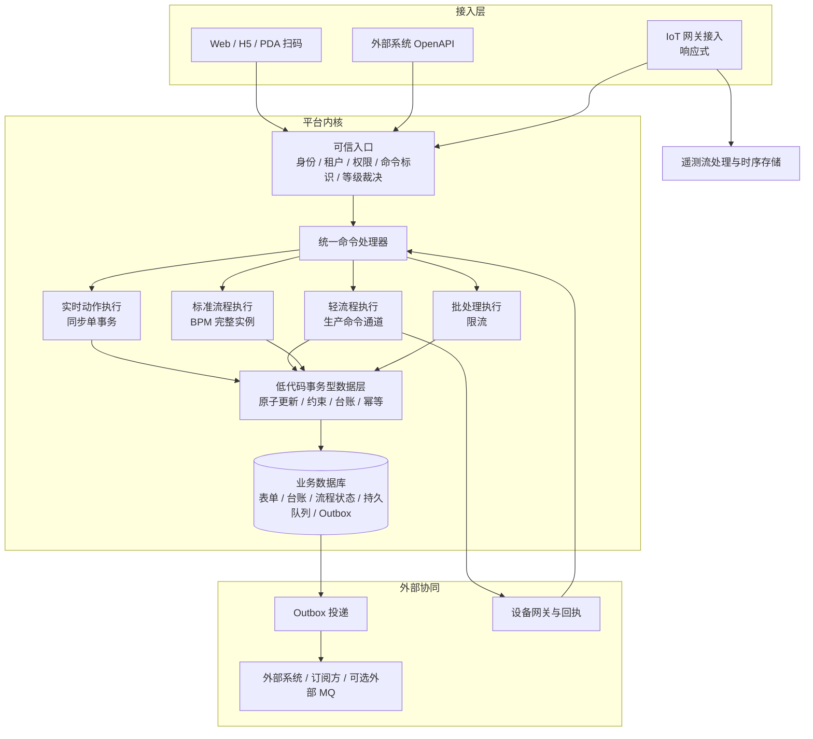

# 平台业务架构指导方案：OA / MES / WMS / IoT

- 版本：v1.0（CTO 指导稿）
- 日期：2026-09-30
- 适用范围：基于低代码与 BPM 构建的多租户业务平台，覆盖 OA、MES、WMS、IoT 四类业务
- 性质：架构方向与技术原则，用于统一团队判断和后续立项。正式实施按工作区治理流程作为 XL 级事项立项、分阶段验收
- 说明：文中时效数值为行业常见参考量级，作为设计预算使用；平台实际能力以实测为准

---

## 1. 一页结论

平台的目标可以概括为一句话：**普通 OA 可靠异步，MES 及时送达，WMS 数据强一致，IoT 可扩展、可追踪；四者共用一个平台内核，不同业务可以按需配置时效和一致性。**

为此，我给出六个核心判断。

1. **BPM 分级是统一入口，但只解决“多快、怎么等、谁先执行”。** 一致性来自数据层的事务能力，分级无法提供一致性。两者作为独立维度设计，任何时效等级下，库存类动作都必须原子提交。
2. **低代码数据层的事务能力是 WMS 成立的前提，也是当前优先级最高的建设项。** 普通表单那种“读整行、改、写回”的保存方式不能承载库存。平台需要提供原子条件更新、数据约束、余额与流水同事务、动作级幂等等能力，并让实施人员可以声明式配置。
3. **平台内部的强一致性依靠同库本地事务获得。** 表单数据、库存台账、流程状态在同一个数据库时，一个事务就能完成，不需要分布式事务，也不需要 Outbox。Outbox 只用于通知外部系统和异步订阅方。
4. **高频生产动作不创建完整流程实例。** 过站、扫码、预占这类动作走“实时动作”形态：同步单事务，不写流程实例和历史。完整 BPM 实例只留给需要人工节点或长生命周期的流程。这是 MES 性能能否成立的关键。
5. **消息通道默认使用数据库持久队列，外部 MQ 作为可选适配器；暂不建设独立的内存加急通道。** 在亚秒级和秒级时效档中，可靠持久化与投递通常只占几毫秒到几十毫秒，通常不是瓶颈。真正的瓶颈多在流程引擎写入、表达式解释、动态宽表查询和库存热点锁。
6. **平台与部署拓扑无关。** 同一套能力可部署在云端、厂区本地或“云 + 边缘”。时效承诺只覆盖服务端处理时间；库存按“单一权威分区”设计，每个仓库在任一时刻只有一个权威写入点，不做多点写入后合并。

执行模型方面，事务型业务采用阻塞式编程配合虚拟线程；Reactor / WebFlux 只用于 IoT 接入、实时推送和遥测流处理，不作全面响应式改造。

---

## 2. 设计原则

| 编号 | 原则 | 含义 |
|---|---|---|
| P1 | 正确性优先于时效 | 任何等级都不能以牺牲数据正确性换取速度；来不及时，应及时暴露真实状态 |
| P2 | 时效与一致性正交 | 时效等级挂在流程和动作上，一致性要求挂在数据模型和数据动作上 |
| P3 | 一个命令，一个生命周期 | 同步和异步只是等待方式不同，背后是同一条命令、同一个处理器、同一份幂等记录 |
| P4 | 能在一个事务内完成的，不拆开 | 优先使用同库本地事务；只有跨越真实的系统边界时才引入最终一致 |
| P5 | 完成点必须明确 | 已受理、业务已提交、设备已执行是三个不同的完成点，接口和界面不能混用 |
| P6 | 规则由服务端裁决 | 等级、通道、优先级由服务端策略确定，调用方不能自报 |
| P7 | 错误配置在发布时拦截 | 低代码配置由实施人员完成，平台在发布阶段校验，不留到运行时 |
| P8 | 按证据优化 | 快速唤醒、响应式改造、物理拆分等优化，必须先有分段延迟证据 |

---

## 3. 业务时效分档

下表是设计预算，供分级模型和容量规划使用。数值为行业常见参考，项目可按实际业务调整。

| 档位 | 典型场景 | 设计预算（服务端） | 承担方 |
|---|---|---|---|
| T0 硬实时 | 设备联锁、安全停机、运动控制 | 10 ms 量级，确定性 | PLC / 边缘控制器；平台不进入关键路径 |
| T1 实时交互 | 过站校验、扫码出入库、库存预占、质检判定 | P99 ≤ 300 ms；操作员感知 ≤ 1 s | 平台“实时动作”，同步单事务 |
| T2 生产命令 | 派工、安灯、设备指令下发、异常升级 | 目标系统受理 P99 ≤ 1–3 s | 平台“轻流程”，独立可靠通道 |
| T3 标准流程 | OA 审批、变更、申请 | 受理 ≤ 1 s 返回；办理可排队，分钟级 | 平台“标准流程”，普通异步 |
| T4 后台批量 | 报表、导入、数据同步、归档 | 小时级，可限流 | 平台“批处理” |

时效预算需要注意三点。

- **预算只覆盖平台内部时间。** 网络耗时由部署方式决定。同一套平台部署在云端和厂区时，服务端预算相同，端到端体验不同，交付时应分别说明。
- **完成点要随预算一起定义。** T1 的完成点是“业务事务已提交”；T2 的完成点是“目标系统已受理”，设备执行结果另行回执。
- **T0 不属于平台职责。** 平台负责向现场控制层下达业务意图，并追踪结果，不承担确定性控制。

---

## 4. 目标架构

### 4.1 分层视图

### 4.2 各层职责

| 层 | 职责 | 关键约束 |
|---|---|---|
| 接入层 | 协议适配、连接管理、推送 | IoT 接入与遥测可响应式；不承载业务规则 |
| 可信入口 | 认证、租户、权限、命令标识、等级裁决、准入限流 | 等级由服务端策略确定；超额时明确拒绝 |
| 统一命令处理器 | 幂等、顺序、截止时间、状态机、结果记录 | 同步与异步共用；不允许绕过 |
| 四种执行形态 | 按等级提供不同执行方式和资源池 | 资源按等级与租户双维度隔离 |
| 事务型数据层 | 原子更新、约束、台账、同事务写入 | 库存类数据只能经事务型动作写入 |
| 外部协同 | 可靠对外通知、设备命令与回执 | Outbox 只用于跨系统边界 |

### 4.3 领域权威

四类业务在同一个平台上构建，但数据的写入权归属必须清楚。

| 领域 | 权威数据 | 写入规则 |
|---|---|---|
| BPM | 流程实例、任务、办理记录、协调进度 | 只推进流程，不直接改写库存或生产事实 |
| WMS | 库存余额、预占、出入库流水、库位与批次 | 只能经库存事务型动作写入 |
| MES | 工单、工序、过站、放行、生产状态 | 经生产动作写入，与所用库存动作可在同一事务中完成 |
| IoT | 设备命令生命周期、回执、遥测 | 命令先持久化再下发；遥测独立存储 |

同一个流程可以同时调用 WMS 和 MES 的动作，并在一个事务内完成；但动作本身由各自领域定义，流程配置不能直接写底层数据表。

---

## 5. BPM 分级模型

这是本方案的核心。分级模型由三个维度组成：时效等级、执行形态、一致性要求。前两个维度绑定在一起，第三个维度独立存在。

### 5.1 时效等级与执行形态

| 时效等级 | 执行形态 | 是否创建流程实例 | 等待方式 | 通道与资源 | 允许的节点 |
|---|---|---|---|---|---|
| T1 | 实时动作 | 不创建；只写业务数据与审计 | 同步，等待事务结果 | 独立预留资源池，最高准入优先级 | 自动节点、规则判断、事务型数据动作 |
| T2 | 轻流程 | 创建短生命周期实例，历史精简 | 有界等待目标受理；超时返回命令标识 | 生产命令通道，预留容量 | 自动节点、外部调用、设备命令、定时与超时 |
| T3 | 标准流程 | 创建完整实例与历史 | 受理即返回，异步推进 | 普通通道 | 全部节点，含人工节点 |
| T4 | 批处理 | 按需 | 异步 | 批量通道，限流 | 自动节点 |

设计要点有四个。

- **T1 实时动作是性能关键。** 过站、扫码等高频动作如果每次都创建完整流程实例，流程引擎的实例和历史写入会成为最先出现的瓶颈。实时动作只写业务数据和一条审计记录。
- **T2 轻流程的历史精简。** 保留关键状态与结果，省去逐节点的完整历史快照，以降低写放大；审计所需信息仍完整保存。
- **等级之间可以衔接，但只能通过命令衔接。** 例如 T3 审批通过后，触发 T2 派工；T1 过站发现异常后，发起 T3 异常处置流程。低等级流程不能同步等待高等级流程中的人工节点。
- **P4 中的“P0 同步优先”可以对应到 T1 / T2。** “普通 OA 异步”对应 T3。原有的专用授权、幂等和回查语义全部保留。

### 5.2 一致性要求（独立维度）

| 一致性要求 | 适用数据 | 平台保证方式 |
|---|---|---|
| C1 强一致 | 库存余额、预占、工单状态、计数类业务数据 | 只能通过事务型数据动作写入；原子提交；约束兜底 |
| C2 最终一致 | 看板、统计、查询投影、外部系统副本 | 基于提交后事件更新；可延迟，可重建 |
| C3 无强要求 | 遥测、操作日志、调试信息 | 高吞吐写入，允许聚合和抽样 |

一致性要求在**数据模型上声明**，与调用它的流程等级无关。T3 普通审批流程修改库存时，同样必须经过 C1 事务型动作。这样可以避免“慢流程顺手改库存”绕开保护。

### 5.3 发布时校验

规则由实施人员配置，平台在发布阶段强制校验，拦截以下配置：

- T1 实时动作中包含人工节点、定时等待或未配置超时的外部调用。
- C1 数据被直接写入，没有经过事务型数据动作。
- 一个事务型动作跨越异步边界，例如预占在一个节点、扣减在另一个异步节点，但中间没有定义预占凭据和过期规则。
- 外部接口调用未配置超时、重试上限和失败策略。
- 使用 T1 / T2 等级，但缺少对应的专用授权。
- 脚本节点直接访问 C1 数据表。

校验失败时给出可理解的错误和修改建议，不能发布。

### 5.4 等级授权

T1 / T2 占用预留资源，必须受控使用。

- 使用高等级需要专用权限，沿用 P4 中 P0 专用授权的思路，并叠加目标对象原有的操作权限。
- 等级在流程或动作发布时确定，运行时调用方不能提升等级。
- 每个租户的 T1 / T2 额度单独配置，防止一个租户把高等级当成普通通道使用。

---

## 6. 低代码事务型数据能力

这是 WMS 成立的前提，建议作为第一优先级建设。

### 6.1 必备能力

| 能力 | 说明 | 典型用途 |
|---|---|---|
| 原子增减与条件更新 | 在数据库中完成“满足条件才更新”，不经“读—改—写”往返 | 可用量 ≥ 扣减量时才扣减 |
| 数据约束 | 非负、唯一、取值范围、引用存在等约束，由数据库或平台在事务内强制执行 | 库存不得为负，业务单号唯一 |
| 台账模型模板 | 余额表与流水表成对建模，同事务写入，余额可由流水复算 | 库存台账、物料台账 |
| 动作级幂等键 | 同一业务意图重复提交只生效一次；相同键不同内容明确冲突 | 扫码重复提交、网络重试 |
| 乐观版本 | 更新时校验版本，冲突时明确失败或有界重试 | 工单状态迁移 |
| 同事务组合 | 表单数据、台账、流程状态、待发送事件在同一事务中提交 | 出库单提交同时扣减库存并推进流程 |
| 预占凭据 | 预占生成带有效期的凭据，后续扣减或释放必须引用凭据 | 领料预占到生产消耗 |
| 写入权限隔离 | C1 数据只允许事务型动作写入，脚本和普通表单保存不能直写 | 防止绕过 |

这些能力应以**声明式配置**提供给实施人员，例如“在库存台账上执行扣减动作，数量取自表单字段，失败时提示库存不足”，而不是要求实施人员写 SQL 或脚本。

### 6.2 库存维度与粒度

库存的权威单位需要按业务确定，常见维度包括租户、货主、仓库、库区、库位、物料、批次、质量状态和序列号。平台应支持按模板选择维度组合，锁定和校验按实际维度执行，避免只按物料粗粒度锁定造成大面积冲突。

### 6.3 热点处理

库存热点，例如同一物料、同一库位被高频扣减，是 T1 时效最常见的风险。建议按以下顺序处理：

1. 缩短事务：事务内只做必要的条件更新和写流水，外部调用移到事务外。
2. 细化粒度：按库位、批次拆分库存行，减少同一行的竞争。
3. 固定加锁顺序：一次操作涉及多行时，按统一顺序锁定，避免死锁。
4. 有界重试：冲突时有限次数重试，超过后明确失败，不做无限重试。
5. 最后才考虑分桶：把一行库存拆成多个桶并发扣减，查询时汇总。这会增加复杂度，只在实测证明必要时采用。

### 6.4 对账

强一致也需要可验证。平台应提供台账对账能力：余额等于流水汇总、预占总量等于有效凭据汇总。对账结果作为运行指标持续监控，正常情况下差异应为零；出现差异时触发告警和人工处置。

---

## 7. 通道、消息与一致性传播

### 7.1 默认实现

| 组件 | 默认实现 | 可选增强 |
|---|---|---|
| 命令持久队列 | 数据库表，按等级分队列，领取时使用 FOR UPDATE SKIP LOCKED 等并发安全方式 | 外部 MQ 适配器 |
| 唤醒机制 | 数据库通知或进程内通知唤醒消费者，辅以兜底轮询 | 无 |
| 对外事件 | Outbox 表，与业务数据同事务写入，投递器发布 | 投递到外部 MQ |
| 遥测 | 独立接入与时序存储 | 流处理平台 |

以数据库持久队列作为默认实现，有三个理由：与业务数据在同一事务中写入，天然避免“数据已提交、消息没发出”；不强依赖外部中间件，适合厂区本地和边缘部署；在 T1–T3 的时效预算下，性能通常足够。当需要跨进程大规模扩展或与外部系统集成时，再启用外部 MQ 适配器，业务契约保持不变。

### 7.2 Outbox 的使用边界

- **平台内部的一致性不用 Outbox。** 同库数据在同一事务中提交即可。
- **跨系统边界使用 Outbox。** 通知外部系统、写入外部 MQ、更新查询投影时，事件与业务数据同事务写入 Outbox，再由投递器发布。
- **关键链路不依赖 Outbox 串联。** 例如“预占成功后放行”这类 T1 链路，放在同一个事务或同一个实时动作中完成，不通过“提交—发事件—消费—再处理”串联，以免投递延迟进入关键路径。
- **Outbox 投递可能重复。** 所有订阅方必须幂等。

### 7.3 内存加急通道

暂不建设独立的内存加急执行通道。原因是：

- 在 T1–T3 预算下，持久化与投递通常不是主要耗时。
- 内存通道与持久通道并存时，需要额外解决重复执行、顺序、崩溃恢复和双路竞争问题，长期维护成本高。

如果后续实测证明调度等待确实超出预算，允许采用**持久命令 + 快速唤醒**：命令先持久化，再用内存通知立即唤醒执行器；通知丢失时，兜底机制仍能找到同一条命令。快速路径与兜底路径共享同一套领取规则和幂等记录。

---

## 8. 资源隔离与多租户容量

### 8.1 双维度隔离

资源按“时效等级 × 租户”双维度管理。

| 资源 | 隔离方式 |
|---|---|
| 执行并发 | 每个等级独立并发额度；T1 / T2 预留容量，不被 T3 / T4 借用 |
| 数据库连接 | 按等级划分连接池或连接额度，作为最终的并发闸门 |
| 队列 | 按等级分队列；租户间按权重公平调度 |
| 准入限流 | 按租户和等级设置额度，超额时明确拒绝 |
| 遥测 | 独立资源和存储，不占用业务数据库主写入能力 |

需要特别说明：采用虚拟线程后，线程不再是稀缺资源，**数据库连接成为真正的并发上限**。等级隔离必须落到连接额度上，否则高并发的低等级任务仍会占满连接，拖慢 T1。

### 8.2 过载策略

过载时按等级从低到高依次降级：

1. 暂停或限流 T4 批处理。
2. T3 继续受理并排队，放慢执行速度。
3. T2 保持预留容量；超出容量时明确拒绝，调用方按预案处置。
4. T1 保持预留容量；超出时快速失败并给出明确提示，不做长时间排队。

原则是：**宁可明确拒绝，也不能无限排队后仍然声称“及时”。**

---

## 9. 部署拓扑

平台不预设是否断网，同一套能力支持三种拓扑，由项目按需选择。

| 拓扑 | 形态 | 适用场景 | 说明 |
|---|---|---|---|
| A 云端集中 | 平台全部部署在云端 | 网络可靠、以 OA 为主的场景 | 端到端时效包含公网延迟 |
| B 厂区本地 | 平台整体部署在厂区 | 对时效和断网敏感的工厂 | 与云端版本一致，按需向集团同步 |
| C 云 + 边缘 | 集团级能力在云端，仓库或产线的权威节点在现场 | 多工厂、多仓库集团 | 现场节点断网时继续作业，恢复后同步 |

### 9.1 单一权威分区

为兼顾强一致和断网作业，库存等 C1 数据按“单一权威分区”设计：

- 每个权威范围（通常是一个仓库或一条产线）在任一时刻只有一个权威写入节点。
- 需要断网作业时，把该范围的权威节点部署在现场；云端持有只读副本，并接收同步。
- 不做多个节点各自写入同一库存、事后合并的方案。多点写入后合并库存，本身就违背强一致要求。
- 权威节点迁移（例如从云端迁到现场）是受控的运维操作，迁移期间该范围暂停写入。

### 9.2 拓扑无关的设计要求

- 默认实现不强依赖外部 MQ 或特定云服务。
- 服务端时效预算与网络耗时分开度量、分开承诺。
- 跨节点同步统一使用 Outbox 与幂等消费。
- 命令、事件和台账的身份在全局唯一，不依赖某一个节点的自增序列。

---

## 10. 执行模型

| 场景 | 推荐模型 | 理由 |
|---|---|---|
| 事务型业务（T1–T4 执行、低代码数据动作、BPM 推进） | 阻塞式编程 + 虚拟线程 | JDBC 和流程引擎本身阻塞；虚拟线程提高并发等待能力，保留现有事务与上下文模型 |
| IoT 设备接入网关 | 响应式（Reactor / Netty） | 大量长连接和高频小消息，背压有价值 |
| 实时推送（看板、SSE、WebSocket） | 响应式 | 大量并发连接、事件推送 |
| 遥测流处理 | 响应式或流处理框架 | 聚合、窗口、背压 |
| 同步等待命令结果 | 虚拟线程等待，或响应式等待 | 两者均可；关键是等待不占用稀缺资源 |

使用虚拟线程需要注意：确认 JDK 版本及同步代码块造成的线程钉住问题（JDK 21 存在该问题，JDK 24 已对 synchronized 做了改进）；ThreadLocal 上下文在虚拟线程中仍然可用，但要控制其内存占用；数据库连接池必须作为显式的并发闸门。

响应式部分需要注意：阻塞调用不能进入事件循环线程；身份、租户、追踪上下文需要显式传递；响应式链路中的重试和重新订阅不能代替业务重试策略。

---

## 11. 统一命令契约

### 11.1 命令要素

| 要素 | 作用 |
|---|---|
| 命令标识 | 全局唯一，贯穿同步、异步、回查和恢复 |
| 幂等键 | 标识业务意图；相同键不同内容时冲突 |
| 租户、操作人、授权上下文 | 入口确定，消费时恢复并复核 |
| 时效等级 | 服务端按发布配置确定 |
| 顺序键 | 流程实例、库存对象、工单或设备；只在键内保证顺序 |
| 截止时间 | 超过后动作失去业务意义，执行前必须检查 |
| 内容摘要 | 用于识别同键不同内容 |

### 11.2 命令状态

| 状态 | 含义 |
|---|---|
| 已受理 | 已持久化，恢复机制可以找回 |
| 执行中 | 已被领取并正在执行 |
| 成功 | 达到该命令定义的完成点，结果已保存 |
| 失败 | 明确失败，给出可理解的原因 |
| 已过期 | 超过截止时间，未执行或已停止 |
| 结果待核实 | 外部动作可能已发生但结果未知，需要对账后决定，不能盲目重发 |

### 11.3 两种超时

- **等待超时：** 调用方不再等待，返回命令标识和当前状态；命令继续执行，不重建任务。
- **业务截止：** 超过截止时间后，命令不再执行；已经产生外部副作用的，进入对账处置。

调用方超时或断开连接，不影响已受理命令的生命周期。

---

## 12. 故障与降级

### 12.1 系统级故障

| 故障 | T1 实时动作 | T2 生产命令 | T3 标准流程 | 处置原则 |
|---|---|---|---|---|
| 外部 MQ 不可用 | 不受影响（不经 MQ） | 默认队列不受影响；外部投递积压在 Outbox | 不受影响 | 恢复后自动补投 |
| 数据库主库切换 | 快速失败并提示，现场按预案处置 | 暂停受理，恢复后继续 | 暂停受理，恢复后继续 | 不在切换期间承诺成功 |
| 生产通道积压 | 不受影响（独立资源） | 超容量明确拒绝 | 放慢执行 | 按过载策略逐级降级 |
| 单租户突发流量 | 按租户限流 | 按租户限流 | 按租户限流 | 不影响其他租户 |
| 设备或网关离线 | 不涉及 | 进入等待，超过截止则过期 | 不涉及 | 回执缺失标记待核实 |
| 边缘节点断网 | 本地继续 | 本地继续 | 按部署决定 | 恢复后经 Outbox 同步 |

### 12.2 单笔业务故障

以“审批通过 → 领料预占 → 生产放行 → 设备动作”为例：

| 故障位置 | 期望行为 |
|---|---|
| 预占事务失败 | 不产生预占；调用方收到明确失败 |
| 预占成功、放行失败 | 按业务规则保留或释放预占；凭据过期自动释放 |
| 预占过期与放行同时发生 | 在权威台账上原子裁决，只有一方生效 |
| 设备命令已发送、回执丢失 | 标记结果待核实，对账后决定是否重发 |
| 恢复时已超过生产窗口 | 按截止时间判定过期，进入受控处置 |
| 重复提交或重复投递 | 按幂等键只生效一次 |

---

## 13. 与现有能力的衔接

现有 P4 设计已经提供了普通 OA 可靠异步与 P0 同步优先两条路径，并采用数据库持久受理、统一命令边界、幂等和回查语义，同时预留 MQ 接口。这些设计与本方案方向一致，建议保留并扩展：

| 现有能力 | 本方案中的演进 |
|---|---|
| 普通 OA 异步 | 对应 T3 标准流程 |
| P0 同步优先 | 拆分为 T1 实时动作与 T2 轻流程 |
| P0 专用授权 | 扩展为等级授权与租户额度 |
| 数据库持久受理 | 作为默认队列实现，按等级分队列 |
| MQ 接口预留 | 作为可选适配器 |
| 受理—回查 | 纳入统一命令状态 |

迁移时，运行中的命令和历史结果必须能继续查询和恢复；新旧两套消费者不能同时执行同一条命令。

---

## 14. 演进路线

各阶段按顺序推进，每个阶段有明确的退出条件。阶段的正式立项、方向与验收按工作区治理流程执行。

| 阶段 | 目标 | 主要内容 | 退出条件 |
|---|---|---|---|
| 阶段 0 度量基线 | 看清现状 | 端到端分段埋点：入口、受理、排队、执行、数据库、引擎、外部调用；建立各类操作的延迟基线 | 能按等级报告 P50 / P99 与各段耗时 |
| 阶段 1 事务型数据能力 | 让 WMS 成立 | 原子条件更新、约束、台账模板、动作级幂等、同事务组合、预占凭据、写入权限隔离、对账 | 并发扣减、重复提交、故障恢复下对账差异为零 |
| 阶段 2 分级模型与命令契约 | 让 MES 可配置 | 四种执行形态，T1 不创建实例，发布时校验，等级授权，统一命令状态与超时语义 | T1 典型动作满足预算；错误配置可在发布时拦截 |
| 阶段 3 隔离与降级 | 让时效可预期 | 等级 × 租户资源隔离，连接额度，准入限流，过载与故障降级 | 低等级压满时，T1 / T2 仍在预算内；故障演练结果符合 §12 |
| 阶段 4 拓扑适配 | 让平台可部署于各类现场 | 外部 MQ 适配器、Outbox 跨节点同步、单一权威分区、边缘节点 | 三种拓扑均能部署；断网恢复后数据一致 |
| 阶段 5 按证据优化 | 持续改进 | 快速唤醒、热点分桶、响应式接入扩展、物理拆分 | 每项优化有前后对比数据 |

阶段 1 与阶段 0 可以并行启动；阶段 2 依赖阶段 1 的事务能力；阶段 4 可在阶段 3 之后按客户需求启动。

---

## 15. 度量指标

| 类别 | 指标 | 目标 |
|---|---|---|
| 时效 | 各等级受理与完成的 P50 / P99 | 满足 §3 预算 |
| 时效 | 队列最老消息等待时间 | T1 / T2 接近零 |
| 时效 | 截止时间错过率 | T1 / T2 持续监控并告警 |
| 一致性 | 台账对账差异 | 零 |
| 一致性 | 重复业务效果次数 | 零 |
| 可靠性 | 已受理命令丢失数 | 零 |
| 可靠性 | 结果待核实数量与处置耗时 | 持续下降 |
| 容量 | 各等级资源使用率、拒绝次数 | 预留容量不被挤占 |
| 多租户 | 各租户限流触发次数 | 可解释 |

指标按租户、等级和部署节点分别统计。

---

## 16. 反模式清单

团队在设计和评审时，发现以下做法应直接否决：

1. 用高优先级或同步调用来“保证”一致性。
2. 普通表单保存直接写库存，或脚本节点绕过事务型动作。
3. 每次过站、扫码都创建完整流程实例。
4. 同步等待人工节点完成。
5. 平台内部同库数据也经 MQ 或 Outbox 串联，把一个事务拆成多段最终一致。
6. 内存队列与持久队列各自执行同一条命令。
7. 调用方自报优先级或等级。
8. 等待超时后重新创建命令。
9. 把“消息已投递”或“已受理”当作“业务已完成”或“设备已执行”。
10. 库存多节点各自写入后再合并。
11. 无限重试或无限排队，同时仍承诺及时。
12. 在没有分段延迟证据的情况下做性能架构改造。

---

## 17. 架构决策汇总

| 编号 | 决策 | 结论 |
|---|---|---|
| D01 | 总体架构 | 低代码事务型数据层 + BPM 分级 + 可靠通道 + 资源隔离 |
| D02 | 直接执行与异步受理 | 由等级决定：T1 同步单事务，T2 有界等待，T3 / T4 异步；共用命令处理器 |
| D03 | WMS 一致性 | 同库本地事务 + 事务型数据动作 + 约束兜底 + 对账 |
| D04 | 资源隔离 | 等级 × 租户双维度；连接额度作为并发闸门 |
| D05 | MES 时效 | 采用 §3 分档作为设计预算，实测校准 |
| D06 | 内存加急通道 | 不建设独立通道；证据成立后可采用持久命令 + 快速唤醒 |
| D07 | 执行模型 | 事务型业务用阻塞式 + 虚拟线程；接入、推送、遥测用响应式 |
| D08 | 跨域失败处理 | 预占凭据、原子裁决、结果待核实、对账处置 |
| D09 | 外部 MQ | 作为可选适配器，选型按客户部署与集成需求决定 |
| D10 | 低代码事务型数据能力 | 第一优先级建设 |
| D11 | BPM 分级模型 | 时效等级 + 执行形态 + 发布校验；一致性为独立维度 |
| D12 | 部署拓扑 | 拓扑无关；库存单一权威分区；时效预算只覆盖服务端 |

---

## 18. 风险与需要核实的事实

以下事实会影响实施方式，但不改变本方案方向。启动阶段 0 和阶段 1 时，由执行团队核实：

| 事项 | 影响 |
|---|---|
| 当前流程引擎能否在不创建持久实例的情况下执行 | 决定 T1 实时动作是扩展引擎，还是另建轻量执行器 |
| 低代码数据层现有的并发写入方式 | 决定事务型数据能力的改造量 |
| 表单数据与流程状态是否在同一事务提交 | 决定同事务组合的改造量 |
| 现有持久队列的领取与恢复机制 | 决定能否直接扩展为分等级队列 |
| JDK 与数据库版本 | 决定虚拟线程可用性及并发控制细节 |
| 动态宽表在高频场景下的查询性能 | 可能成为 T1 瓶颈，需要索引或专用表结构 |

主要风险如下：

- **事务型数据能力建设周期较长。** 这是 WMS 的前提，建议尽早启动。
- **T1 执行形态可能需要调整流程引擎。** 改造范围取决于引擎现状。
- **实施人员的配置能力参差不齐。** 发布时校验和反模式拦截需要持续完善。
- **边缘部署增加运维复杂度。** 阶段 4 按客户需求启动，不作为默认交付。

---

## 19. 参考资料

1. [Spring WebFlux 执行模型与性能考虑](https://docs.spring.io/spring-framework/reference/6.2/web/webflux/new-framework.html)
2. [Reactor 阻塞调用适配](https://projectreactor.io/docs/core/release/reference/faq.html)
3. [RabbitMQ 优先级队列](https://www.rabbitmq.com/docs/priority)
4. [RabbitMQ 确认机制](https://www.rabbitmq.com/docs/confirms)
5. [PostgreSQL 事务隔离](https://www.postgresql.org/docs/current/transaction-iso.html)
6. [Transactional Outbox 模式](https://microservices.io/patterns/data/transactional-outbox.html)
7. [JEP 444: Virtual Threads](https://openjdk.org/jeps/444)
8. [JEP 491: Synchronize Virtual Threads without Pinning](https://openjdk.org/jeps/491)
9. 工作区现有设计：`product/p4-oa-personal-center-dual-dispatch/passed/direction-p4-oa-personal-center-dual-dispatch.md`

